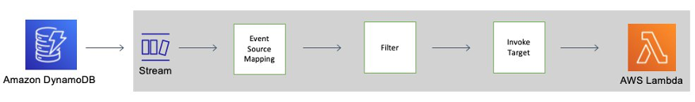

# DynamoDB Lambda S3 Data Archival


## <!--BEGIN STABILITY BANNER-->


> **This is a stable example. It should successfully build out of the box**
>
> This example is built on Construct Libraries marked "Stable" and does not have any infrastructure prerequisites to build.

---

<!--END STABILITY BANNER-->

This CDK TypeScript project is intended to be sample code only. Not for use in production.

## Description

In this project, DynamoDB Time to Live (TTL), DynamoDB Streams and AWS Lambda are used to simply archive data to an S3 storage bucket, which is less costly and thus reducing DynamoDB DynamoDB storage costs, and also reduces code complexity. Lambda event filtering is applied to the Lambda event source mapping, which works by identifying JSON patterns in a stream event, of which Lambda is a stream consumer, thereby preventing unwanted invocations of the archive Lambda function.

In the following diagram, you can see how a [Time to Live deleted item is consumed by a Lambda function using streams and event filters](https://docs.aws.amazon.com/amazondynamodb/latest/developerguide/time-to-live-ttl-streams.html):



This template will generate a simple DynamoDB table with a partition key and a TTL attribute with Amazon DynamoDB Streams enabled. It will create a lambda function and a simple Lambda execution role that will allow write logs to Amazon Cloudwatch, and read the events from the Amazon DynamoDB Stream. It will set up the event source mapping between the DynamoDB Streams and the Lambda function, so the function can be executed every time there is an event in the Amazon DynamoDB Stream. With Lambda event filtering, the Lambda function is only triggered by DynamoDB TTL events, which then processes the streams records of the expired items by putting the body of the expired items into the S3 bucket as JSON objects.

The streams record of TTL deleted items contain the following properties that can be defined in the Lambda event filter criteria:

The streams record contains a user identity field `Records[<index>].userIdentity`.

Items that are deleted by the Time to Live process after expiration have the following fields:

`Records[<index>].userIdentity.type: "Service"`

`Records[<index>].userIdentity.principalId: "dynamodb.amazonaws.com"`

The following JSON shows the relevant portion of a single streams record.

```json
"Records": [
    {
        ...

        "userIdentity": {
            "type": "Service",
            "principalId": "dynamodb.amazonaws.com"
        }

        ...

    }
]
```

## Architecture

This CDK project will deploy the following stack to your AWS cloud environment:

- **DynamoDB table** stream-enabled and configured with TTL attribute, `ttl`, and one partition key, `id`
- **S3 Bucket** for data archival
- **Lambda function** triggered by the DynamoDB event source, filtering for TTL events to put as JSON objects in the S3 bucket.
- **Lambda execution role** with policies for CloudWatch log access, and DynamoDB stream read permissions and S3 PutObject permissions granted.
- **CloudWatch Alarm** for lambda timeout after 5 minutes

The `cdk.json` file tells the CDK Toolkit how to execute your app.

## Useful commands

- `npm run build` compile typescript to js
- `npm run watch` watch for changes and compile
- `npm run test` perform the jest unit tests
- `cdk deploy` deploy this stack to your default AWS account/region
- `cdk diff` compare deployed stack with current state
- `cdk synth` emits the synthesized CloudFormation template

## Requirements

- AWS CLI setup
- AWS CDK v2
- CDK deploy user with CloudFormation execution policies
- NodeJS and NPM
- Git

## Build

Build the app from the project root folder in `/cdk` by using `cd cdk`. Run the following to install AWS CDK, project dependencies and build TypeScript files:

```bash
npm install -g aws-cdk
npm install
npm run build
```

## Configure CDK Deploy user

The CDK deploy user must be configured with CloudFormation execution policies in order to bootstrap the environment and to deploy CDK apps to the AWS account and region. The user role and policies can be configured through the console by using the Visual Editor or pasting in the appropriate JSON, and then set it as a user profile e.g. prod through AWS CLI by using `aws configure --profile prod` (`--profile prod` is an optional flag to set a profile other than that of the default profile).

```json
{
  "Version": "2012-10-17",
  "Statement": [
    {
      "Sid": "IamPass",
      "Effect": "Allow",
      "Action": ["iam:PassRole"],
      "Resource": ["*"]
    },
    {
      "Sid": "StsAssume",
      "Effect": "Allow",
      "Action": ["sts:AssumeRole"],
      "Resource": [
        "arn:aws:iam::*:role/cdk-readOnlyRole",
        "arn:aws:iam::*:role/cdk-hnb659fds-deploy-role-*",
        "arn:aws:iam::*:role/cdk-hnb659fds-file-publishing-*",
        "arn:aws:iam::*:role/cdk-hnb659fds-lookup-role-***-<AWS_REGION>"
      ]
    }
  ]
}
```

```json
{
  "Version": "2012-10-17",
  "Statement": [
    {
      "Sid": "VisualEditor0",
      "Effect": "Allow",
      "Action": ["dynamodb:ListTables", "lambda:ListEventSourceMappings"],
      "Resource": "*"
    },
    {
      "Sid": "VisualEditor1",
      "Effect": "Allow",
      "Action": [
        "lambda:CreateFunction",
        "s3:PutObject",
        "lambda:GetEventSourceMapping",
        "lambda:GetFunction",
        "s3:CreateBucket",
        "dynamodb:DescribeStream",
        "dynamodb:GetRecords"
      ],
      "Resource": [
        "arn:aws:lambda:<AWS_REGION>:<AWS_ACCOUNT>:event-source-mapping:*",
        "arn:aws:lambda:<AWS_REGION>:<AWS_ACCOUNT>:function:*",
        "arn:aws:s3:::*",
        "arn:aws:dynamodb:<AWS_REGION>:<AWS_ACCOUNT>:table/*/stream/*"
      ]
    },
    {
      "Sid": "VisualEditor2",
      "Effect": "Allow",
      "Action": [
        "dynamodb:CreateTable",
        "dynamodb:DescribeTable",
        "ssm:GetParameter"
      ],
      "Resource": [
        "arn:aws:ssm:<AWS_REGION>:<AWS_ACCOUNT>:parameter/cdk-bootstrap/hnb659fds/version",
        "arn:aws:dynamodb:<AWS_REGION>:<AWS_ACCOUNT>:table/*"
      ]
    }
  ]
}
```

## Bootstrap

AWS resources will be created in order for AWS CDK apps to be deployed into an environment. These resources include an S3 bucket for storing files, and IAM roles that grant permissions for performing deployments. Running `cdk bootstrap` will synthesise the CDK app and bootstrap the AWS environment.

Only bootstrap once per AWS account and region. If the account and region are different from the default AWS CLI profile, specify the profile:

```
cdk bootstrap

cdk bootstrap aws://ACCOUNT-NUMBER-1/REGION-1

cdk bootstrap --profile prod
```

## Synthesise CloudFormation Template

To synthesise the CloudFormation template for this CDK app, run `cdk synth`.

## Deploy

To deploy from the shell terminal, run the following command `cdk deploy --require-approval never` to deploy the stack to your AWS account. The `---require-approval never` flag will skip prompts to approve security-related changes before deployment, which is useful for CI/CD pipelines, like the GitHub Action step in [.github/workflows/aws-cdk-lambda.yml](.github/workflows/aws-cdk-lambda.yml). If using a specific AWS CLI profile e.g. prod, specify the `--profile prod` flag.

```
cdk deploy

cdk deploy --require-approval never

cdk deploy --profile prod --require-approval never
```

On successful deployment, the following info are output on the screen:

- DynamoDBTableName
- S3BucketName
- TTLProcessingLambdaOutput (lambda function ARN)
- LambdaLogsUrl (URL of CloudWatch logs for the lambda)
- InsertItemWithTTLToDynamoDBCommand (AWS CLI command to put item into DynamoDB table)

## Testing

### Actual Event Testing

It may take up to 48 hours for a TTL expired item to be deleted:

> [Depending on the size and activity level of a table, the actual delete operation of an expired item can vary. Because TTL is meant to be a background process, the nature of the capacity used to expire and delete items via TTL is variable (but free of charge). TTL typically deletes expired items within 48 hours of expiration.](https://docs.aws.amazon.com/amazondynamodb/latest/developerguide/howitworks-ttl.html)

1. In the shell terminal for Mac or Linux system, run `date +%s`.
2. Run the AWS CLI command output to screen on successful deployment of the CDK app:

```sh
$ aws dynamodb put-item --table-name TTLTable-v3 --item '{"id":{"S":"TestId1"},"ttl":{"N":"<UTC_DATE_STRING>"}}'
```

To confirm that the item is added to the table, run this command:

```sh
aws dynamodb get-item --table-name TTLTable-v3 --key '{"id":{"S":"TestId1"}}'
```

3. In the console, navigate to the DynamoDB table created i.e. TTLTable-v3. Under the Additional Settings tab, view the graph of items deleted in the last 24 hours in the Time to Live (TTL) section and obtain the time deleted, which should match the time of lambda invocation in the CloudWatch logs.
4. Navigate to the CloudWatch logs URL as output to the screen.

### Simulated Event Testing

Simulated events do not pass through lambda event filtering as the lambda function is being invoked directly. Therefore the data set used to invoke the function only contains stream event records matching the filter criteria for DynamoDB TTL expired item events, which have the userIdentity property.

1. In the console, navigate to the lambda function created and click on the Testing tab to create a new test event.
2. Populate test with the test data set below and begin test run:

```json
{
  "Records": [
    {
      "eventID": "2353885da57fbf85aab1fbb7cff8935a",
      "eventName": "REMOVE",
      "eventVersion": "1.1",
      "eventSource": "aws:dynamodb",
      "awsRegion": "<AWS_REGION>",
      "dynamodb": {
        "ApproximateCreationDateTime": 1700617129,
        "Keys": {
          "id": {
            "S": "TestId1"
          }
        },
        "OldImage": {
          "id": {
            "S": "TestId1"
          },
          "ttl": {
            "N": "1700615599"
          }
        },
        "SequenceNumber": "4421584500000000017450439094",
        "SizeBytes": 27,
        "StreamViewType": "NEW_AND_OLD_IMAGES"
      },
      "userIdentity": {
        "principalId": "dynamodb.amazonaws.com",
        "type": "Service"
      },
      "eventSourceARN": "arn:aws:dynamodb:<AWS_REGION>:<AWS_ACCOUNT>:table/TTLTable-v3/stream/2023-11-22T01:08:35.939"
    },
    {
      "eventID": "2353885da57fbf85aab1fbb7cff8935a",
      "eventName": "REMOVE",
      "eventVersion": "1.1",
      "eventSource": "aws:dynamodb",
      "awsRegion": "<AWS_REGION>",
      "dynamodb": {
        "ApproximateCreationDateTime": 1700617150,
        "Keys": {
          "id": {
            "S": "TestId2"
          }
        },
        "OldImage": {
          "id": {
            "S": "TestId2"
          },
          "ttl": {
            "N": "1700615599"
          }
        },
        "SequenceNumber": "4421584500000000017450439095",
        "SizeBytes": 27,
        "StreamViewType": "NEW_AND_OLD_IMAGES"
      },
      "userIdentity": {
        "principalId": "dynamodb.amazonaws.com",
        "type": "Service"
      },
      "eventSourceARN": "arn:aws:dynamodb:<AWS_REGION>:<AWS_ACCOUNT>:table/TTLTable-v3/stream/2023-11-22T01:08:35.939"
    }
  ]
}
```

### Test results

1. The corresponding CloudWatch logs for the lambda should display:

```
INIT_START Runtime Version: nodejs:16.v26	Runtime Version ARN: arn:aws:lambda:<AWS_REGION>::runtime:yyyyyy
START RequestId: xxxxxx Version: $LATEST
INFO	Stream event:  {
  "Records": [
    {
      "eventID": "2353885da57fbf85aab1fbb7cff8935a",
      "eventName": "REMOVE",
      "eventVersion": "1.1",
      "eventSource": "aws:dynamodb",
      "awsRegion": <AWS_REGION>,
      "dynamodb": {
        "ApproximateCreationDateTime"": 1700617129,
        "Keys": {
          "id": {
            "S": "TestId1"
          }
        },
        "OldImage": {
          "id": {
            "S": "TestId1"
          },
          "ttl": {
            "N": "1700615599"
          }
        },
        "SequenceNumber": "200000000039386786356",
        "SizeBytes": 27,
        "StreamViewType": "NEW_AND_OLD_IMAGES"
      },
      "userIdentity": {
        "principalId": "dynamodb.amazonaws.com",
        "type": "Service"
      },
      "eventSourceARN": "arn:aws:dynamodb:<AWS_REGION>:<AWS_ACCOUNT>:table/TTLTable-v3/stream/2023-11-22T01:08:35.939"
    }
  ]
}
INFO	Stream record:  {
  "eventID": "2353885da57fbf85aab1fbb7cff8935a",
  "eventName": "REMOVE",
  "eventVersion": "1.1",
  "eventSource": "aws:dynamodb",
  "awsRegion": <AWS_REGION>,
  "dynamodb": {
    "ApproximateCreationDateTime": 1700617129,
    "Keys": {
      "id": {
        "S": "TestId1"
      }
    },
    "OldImage": {
      "id": {
        "S": "TestId1"
      },
      "ttl": {
        "N": "1700615599"
      }
    },
    "SequenceNumber": "200000000039386786356",
    "SizeBytes": 27,
    "StreamViewType": "NEW_AND_OLD_IMAGES"
  },
  "userIdentity": {
    "principalId": "dynamodb.amazonaws.com",
    "type": "Service"
  },
  "eventSourceARN": "arn:aws:dynamodb:<AWS_REGION>:<AWS_ACCOUNT>:table/TTLTable-v3/stream/2023-11-22T01:08:35.939"
}

INFO	Item with ID TestId1 has been deleted due to TTL expiry from TTLTable-v3
INFO	Record for item with ID TestId1 has been put into S3
END RequestId: xxxxxx
REPORT RequestId: xxxxxx	Duration: 1033.79 ms	Billed Duration: 1034 ms	Memory Size: 128 MB	Max Memory Used: 86 MB	Init Duration: 509.21 ms
```

2. Query the S3 bucket object with the key: `records/<ITEM_ID>.json` where ITEM_ID is the `id` of the expired DynamoDB item or download the object in JSON format:

```json
{ "id": "TestId1", "ttl": 1700615599 }
```

The UTC string can be converted back to human readable time format:

```sh
$  date -r <UTC_TIMESTRING> '+%m/%d/%Y:%H:%M:%S'
```

Example:

```sh
$  date -r 1700607504 '+%m/%d/%Y:%H:%M:%S'
11/22/2023:09:58:24
```

This code has been tested and verified to run with AWS CDK 2.105.0

## References

- [Archiving DynamoDB TTL Items with Streams and Lambda](https://medium.com/@leeroy.hannigan/archiving-dynamodb-ttl-items-with-streams-and-lambda-17a8a4c20151)
- [Automatically Archive Items to S3 Using DynamoDB Time to Live (TTL) with AWS Lambda and Amazon Kinesis Firehose](https://aws.amazon.com/blogs/database/automatically-archive-items-to-s3-using-dynamodb-time-to-live-with-aws-lambda-and-amazon-kinesis-firehose/)
- [Working With Read and Write Operations > DynamoDB API > Working with Items](https://docs.aws.amazon.com/amazondynamodb/latest/developerguide/WorkingWithItems.html)
- [Using DynamoDB Time-to-Live (TTL)](https://docs.aws.amazon.com/amazondynamodb/latest/developerguide/time-to-live-ttl-before-you-start.html)
- [DynamoDB Streams and Time to Live](https://docs.aws.amazon.com/amazondynamodb/latest/developerguide/time-to-live-ttl-streams.html)
- [What IAM permissions are needed to use CDK Deploy?](https://stackoverflow.com/questions/57118082/what-iam-permissions-are-needed-to-use-cdk-deploy)
- [CDK Bootstrap](https://docs.aws.amazon.com/cdk/v2/guide/bootstrapping.html)
- [Configure AWS CLI profiles: Configuration and Credential File Settings](https://docs.aws.amazon.com/cli/latest/userguide/cli-configure-files.html)
- [AWS CDK Toolkit: cdk commands](https://docs.aws.amazon.com/cdk/v2/guide/cli.html)
- [DynamoDB Streams and AWS Lambda triggers: Tutorial #2: Using filters to process some events with DynamoDB and Lambda.](https://docs.aws.amazon.com/amazondynamodb/latest/developerguide/Streams.Lambda.Tutorial2.html)
